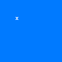

# Remove Distraction - Chrome Extension

<p align="center">
  
</p>

## Overview

**Remove Distraction** is a Chrome extension designed to help you stay focused while browsing YouTube by removing distractions from the home feed and recommended videos. With just a few clicks, you can hide the entire home feed or recommended video section on YouTube.

## Features

- **Hide Home Feed**: Option to hide the entire home feed on YouTube.
- **Hide Recommended Videos**: Hide the "Recommended" section on video pages to eliminate distractions.
- **State Persistence**: The extension remembers your preferences even when the page is reloaded.

## Screenshots

<p align="center">
  
</p>

<p align="center">
  
  
</p>

## Installation

1. Clone or download the repository to your local machine.
    ```bash
    git clone https://github.com/yourusername/remove-distraction.git
    ```

2. Open **Google Chrome** and navigate to `chrome://extensions/`.

3. Enable **Developer Mode** (top right).

4. Click on **Load unpacked** and select the folder where you cloned/downloaded the repository.

5. The extension should now appear in your list of Chrome extensions.

## How to Use

1. Click on the extension icon in your browser's toolbar.
2. A popup will appear with two checkboxes:
   - **Hide Home Feed**: Check this to hide the YouTube home feed.
   - **Hide Recommended**: Check this to hide the recommended videos section.
3. Your preferences will be saved and applied every time you visit YouTube.

## Technical Details

- **Manifest Version**: 3
- **Programming Language**: JavaScript
- **Storage API**: Chrome Storage API is used to persist user preferences.
- **Scripting API**: Chrome Scripting API is used to modify the YouTube DOM.

## License

This project is licensed under the MIT License. See the [LICENSE](LICENSE) file for more details.

## Contributions

Feel free to submit a pull request or open an issue if you'd like to contribute to the project or report any bugs.

---

<p align="center">
  <strong>Remove distractions and stay focused!</strong>
</p>
